[▲](./README.md)

# A Bundle of Stories unfolding around me

_Community experience pattern (rough idea)_

▼

- [Prototype for testing](./Snurvey.md)
- [Story bundle (data structure)](./StoryBundleDataStructure.md)

---

When editing a bundle of stories such as a branching survey,
authors need to focus on the flow of all stories at once.
A navigation-centric interface places the authors "into" the story
and removes all irrelevant context. They can directly modify both
the graph structure and the individual stories flowing through it
without distraction.

```mermaid

graph TD
    A((Start)) --> B[Question 1]
    B --> C[Question 2A]
    B --> |up| D[Question 2B]
    C --> E[Question 3]
    D --> |down| E
    D --> F[Question 3B]
    E --> G((End))
    F --> H((End))

    A --> B
    A --> B
    B --> D
    E --> H
    
    subgraph AccessibleContext ["Accessible Context"]
        subgraph CurrentView ["Current Focus"]
            D
            style D fill:#555,stroke:#ffff00,stroke-width:6px,color:#FFFFFF
        end
        B
        E
        F
        style B fill:#2a2a2a,stroke:#666,stroke-width:2px,color:#FFFFFF
        style E fill:#2a2a2a,stroke:#666,stroke-width:2px,color:#FFFFFF
        style F fill:#2a2a2a,stroke:#666,stroke-width:2px,color:#FFFFFF
    end
    
    style C fill:#2a2a2a,stroke:#666,stroke-width:2px,color:#FFFFFF
    
    classDef empty fill:#333333,stroke:#777777,stroke-width:2px;
    class A,G,H empty;
    
    %% Alternative story - Q1 -> Q2A -> Q3
    linkStyle 1 stroke:#888888,stroke-width:2px;
    linkStyle 3 stroke:#888888,stroke-width:2px;
    
    %% Alternative story path - Q1 -> Q2B -> Q3B
    linkStyle 4 stroke:#FFFF00,stroke-width:6px;
    
    %% Path through Q2A
    linkStyle 0 stroke:#888888,stroke-width:2px;
    linkStyle 2 stroke:#ffff00,stroke-width:6px;
    
    %% Endpoints
    linkStyle 5 stroke:#00ffff,stroke-width:2px;
    linkStyle 6 stroke:#ffff00,stroke-width:6px;
    linkStyle 7 stroke:#00ffff,stroke-width:2px;

    linkStyle 8 stroke:#ffff00,stroke-width:6px;
    linkStyle 9 stroke:#00ffff,stroke-width:2px;
    linkStyle 10 stroke:#00ffff,stroke-width:2px;

    
    style CurrentView fill:#333333,stroke:#FFFFFF,stroke-width:0px,color:#FFFFFF
    style AccessibleContext fill:#1a1a1a,stroke:#888888,stroke-width:0px,color:#BBBBBB
```

<small>

_Diagram: An author is currently positioned at Question 2B on the yellow
storyline. They can now navigate to the previous or next question,
alter the flow of the yellow story at this junction, or switch to the cyan
storyline. The visible context is limited to what's immediately relevant 
to the author's current position in the bundle of stories._

</small>

## Use When

- Creating branching stories (surveys, choose-your-own-adventures,
  pattern languages)
- Storytelling and narrative flow are more important than other concerns
- Users need to intuitively navigate and modify intersecting story paths
- Multiple stories may share common elements but each story remains
  distinct and assessable
- Context-switching would disrupt the creation process
- Users often revise earlier choices

## Background

Two application ideas led me to the same UX pattern. The first is a
viewer/editor for pattern languages where chains of relations between
patterns are first-class objects. The second is a survery viewer/editor
where the author manipulates "stories" (alternative paths through the
graph) explicitly. In both cases, we are traversing/editing two
structures at once: a graph of elements we can visit (patterns resp.
questions) and a collection of stories (all possible visitors' paths).
I have explored a similar problem previously when I experimented with
tree-zippers and made the movingacrossthresholds website.

## Problem

**Traditional UX patterns fails when authoring
interactive, branching narrative structures.**

The survey authoring tools I tested implemented the following, unsuitable
patterns:

- Canvas/Artboard: Drag'n'drop, "bird's eye view" canvas (though not
  usually zoomable and never WYSWIG), Toolbar and modal tools.
  Unsuitable because these feature distract from storytelling.
- Properties pane: Select an object, then open a pane to edit its properties.
  Unsuitable because it adds unnecessary friction and context switching.
- Tabbed interface: Each tab (usually 3 or more) would offer a different
  view on the same model. Even the property panes were often tabbed.
  Unsuitable because it adds unnecessary friction and context switching.
- Code editor: All tools used an embedded language to describe conditional
  connections between questions.
  Unsuitable because it means authors need to parse and compile a computer
  language just to guess how their stories flow.
- Wizard-based editor: Some tools used extremely cumbersome multi-step
  dialogs for editing a story.
  Unsuitable because it obscures the context of an edit and adds massive
  friction with no benefits.
- Linear list: While surveys are inherently graph-shaped, all tools chose to
  represent them in a single dimension, hiding the story structure.
  Unsuitable because it makes it difficult to visualize and understand the
  flow of my stories, and to find questions in the sequence.
- Manual naming: Several tools require the author to name nodes and answers.
  This is not only hard (per Karlton) but completely unnecessary.

All tools I tested distract from the stories I am writing.

Context switching is frustrating

Authoring a survey, a typical sequence of interactions include:

1. Add a question
2. Branch into a new storyline
3. Navigate to an arbitrary question
4. Test a specific storyline

With the tools I tested, each of these tasks brought me into completely different
contexts:

1. To add a question, I had to click "edit the survey", then think about the type of
   answer options (!) I want to offer, then formulate the question.
2. To branch into a new storyline, I had to name (!) the current question, find
   the question I want to branch into, name that one, then find the "Conditions" (!)
   tab, then navigate to the question I want to branch from by searching for its name,
   then assemble a COBOL statement (!) representing the logic I want to use,
   then select the destination question, then double-check the result that this
   operation had on all the other stories that include these questions
3. To navigate to a question, I need to scroll down and up until I find it. Since all
   stories are garbled together into one long list, I can't rely on intuition.
4. To test a specific storyline, I have to click "Run" to open a new window, and
   follow the whole survey through, from start to finish. And potentially all other
   storylines, since they may have been affected by the logic change I made.

## Solution

For editing surveys and similar branching narrative structures, the stories
must be front and center. At any moment, one question is in the center
of my screen, and I can see all stories that traverse it: the context that
matters. The story I am currently following is centered and highlighted.
At a glance, I can distinguish the different storylines.

If I am an author, I can have a limited set of predictable edit operations at
my disposal. Only operations that make sense at the current moment are
available. Things that are not part of the writing process are hidden.

**This pattern uses the following UX patterns:**

1. **Focus on storytelling** - Authors can concentrate on the content at
   their current position without worrying about the entire graph structure
   At a glance, they can see how stories branch and flow. After all, stories
   are what the author creates.
2. **Limiting choices** - Users only see options relevant to their
   current position rather than the entire graph
3. **Progressive disclosure** - Information is revealed gradually
   as users move through the graph
4. **Clear context** - By always knowing exactly where they are,
   users don't need to maintain a mental map of the entire structure
5. **Purely spatial navigation** - The "Up", "Down", and "Choose option"
   commands provide consistent, predictable movement. Interactions
   such as tabbing, searching with Ctrl+F, and scrolling (which web
   users expect) smoothly translate into "up" and "down" movements.
   The temporal navigation paths (browser history and undo history) are
   orthogonal to each other and to the spatial navigation.

### Expected outcomes

_Any UX design lays out a model in time and 2D space.
For example, a geolocation can be shown as a tuple of
numbers, a satellite map, or the name of
the closest city. In each case, the chosen abstraction
requires the user to parse the representation back to
some meaning. Preferably, the representation chosen
is appropriate to the domain and supports a creative
user's flow state._

- Each interaction is immediate, predictable, local, and effective.
  No hidden or intermediate steps, no surprises, no error states.
- Sequential and branching navigation follows the shape and pace of
  the stories told. The context is limited to what is relevant here, now.
- There are no superfluous dimensions (logic languages, collapsible panes,
  dialogs, detached nodes)

## Implementation

I would love to try this. Maybe in a survey authoring app, maybe in a pattern
language editor. Maybe as a library that helps implement such and similar apps.

### Terminology

You are probably familiar with some survey authoring app. In the following,
more technical part, I will be using more general terms. Here is what they
might mean, in the context of a survey editor.

|                     |                                                            |
| ------------------- | ---------------------------------------------------------- |
| **Acyclic**         | The path never loops back to a node you've already visited |
| **Directed**        | The questions in the survey have a fixed sequence          |
| **Connected graph** | All parts of the survey can be reached somehow             |
| **Node**            | A single question in the survey                            |

### Definitions

- A **Node** in the acyclic, directed, connected graph is either empty
  or has content.
- A **Story** is a one continuous path from one empty node to another empty
  node in the graph, traversing adjacent non-empty nodes without loops.
- A **Trace** is the sequence of choices a visitor has made following their story,
  down to their current position. A trace is "complete" at the end of the story.

- A **Visitor** can enter the graph at the beginning of any story and then
  go forward and backward. On nodes traversed by an alternative story, choices
  they make can move them onto the alternative story. They do not need to
  know which story they are on. Their journey ends once they reach an empty
  node. Visitors cannot alter the graph or the stories. They can always revisit
  their trace and change past choices.
- A **Choice** may be an answer in a multiple-choice survey or a decision
  in a hypertext adventure. Visitors can revise their choices by going "up".
- An **Author** can traverse the graph and make choices just like a visitor.
  In addition, they can make edits at their current position. They can also alter
  the available choices at any node (not discussed in this document).
- An **Edit** is an operation on the structure that directly alters the graph or
  the current story, or switches between stories.
- Any edit to the graph may require an implicit **Repair** to the stories, and
  vice versa, to preserve the invariants as listed below.
- An author starts on the following **initial Storygraph**: an empty node,
  followed by another empty node. A single story leads from the current to the
  succeeding node. This is also happens to be the minimal Storygraph satisfying
  the definitions and invariants.

### Invariants

1. **Full Coverage:** All nodes and edges of the directed acyclic graph are
   traversed by at least one story
2. **Uniqueness:** No two stories follow identical paths through the graph
3. **Constructibility:** Every valid storygraph can be turned into any
   other valid storygraph through a series of edits

The author can make direct edits to both the graph (nodes and edges) and to
the stories. Our problem is that edits to the graph might require changes to
the stories, and edits to a story may incur changes to the graph.

We need a **set of edits** with the following properties:

- it can be described as a simple english-language imperative such as "skip story"
- the set is very small (preferably under 10)
- it includes "left", "up", "right", and "down" for traversing the graph and/or
  for modifying a node value
- while it is inevitable that the available edits would vary with the situation,
  it will be nice to have at least some edits "work in every situation"
- it is not too hard to anticipate the effects of any edit, including the necessary
  repairs
- the repairs are not too disruptive

### Navigation commands

Visitors and authors traverse the Storygraph the same way. At any moment,
their "current" position is one node and one story.

1. **Up** - Visit the previous node in the story (unavailable if already at start)
2. **Down** - Visit the next node in the story (unavailable if already at end)
3. **Choose option** - Determines which story I'm on (if there are several at
   my current position)

### Edit operations

Authors can use the following commands to alter the Storygraph:

- **Undo** - Go back to the previous, different state.

- **New node** - Add an intermediate empty node on the present story between
  the current and the next node, and navigate there. Also opens a search box
  where the author can find an existing node to -> replace this empty node.
- **New story** - Add an intermediate empty node on a copy of the current story,
  and navigate there. Also opens a search box where the author can find an
  existing node to -> replace this empty node.

- **Edit node** - Set the node value. Setting it to "empty" makes the node empty.
  The node value includes its options.
- **Replace node** - Replace an empty node with an existing one.
  _Only available following the edit -> "New node" or -> "New story"._

- **Skip node** - Remove the current node from the current story. Navigate up.
  _Only available if another story also traverses the current node._
- **Join other story** - Let the remainder of the current story copy the
  remainder of another story that traverses the current node. _Only available
  if there are more stories traversing the current node._ Cycles through them.

## Related patterns

- **Anonymous-first**: Let authors start writing publicly without authenticating them
- **Offline-first**: Use local storage and import/export functionality so users don't need to go online as much
- **Afk-first**: Create scannable QR codes for physical sharing of stories in community settings, and export to PDF
- **Shareable URLs**: Generate unique links that encode exactly one model
- **p2p collaboration**: Let users work together without a central server in between
- **Live presence**: Show where peers are right now, within the collaborative datastructure
